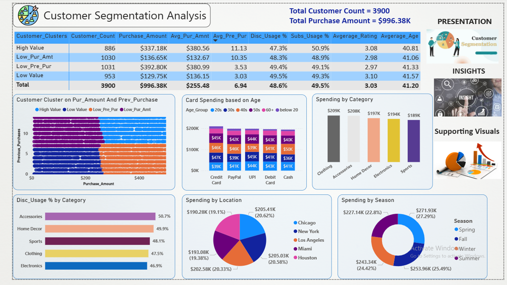
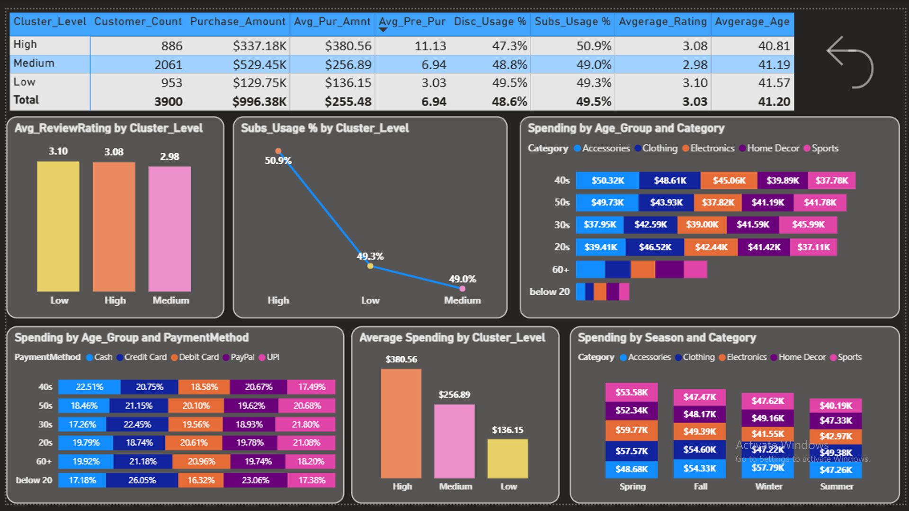

# Customer Segmentation Analysis

## 📌 Project Overview
This project focuses on grouping customers based on their purchasing behavior to help the marketing team target them more effectively.

## 🛠️ Tools Used
* **Data Extraction:** SQL
* **Data Visualization:** Power BI
* **Documentation:** MS Word / PowerPoint

  ## ⚙️ Work Flow

### 1. SQL Data Analysis & Preparation
* **Data Exploration:** Connected to the `project_shopping_trends` database and performed initial EDA to understand the schema and record counts.
* **Feature Engineering:** Created and updated a new `age_group` column to facilitate demographic analysis.
* **Cleaning & Validation:** Verified data integrity by checking for null values and errors; renamed tables for query efficiency.
* **Aggregations:** Performed multi-dimensional analysis including total spending by category, location, and season, as well as payment method distribution by age.

### 2. Power BI Visualization & Advanced Analytics
* **Problem Solving:** Encountered SQL connection issues (Error 40); successfully pivoted to a CSV/Excel-based workflow to ensure project continuity.
* **Advanced Segmentation (Clustering):** Self-taught the concept of **Customer Clustering** via research. Implemented K-Means style clusters and developed a matrix table for cluster-wise metrics.
* **Dashboard Design:** Built an interactive report focusing on scatter plots for segment visualization and matrix tables for deep-dive KPIs.
* **Refinement:** Polished the UI by adjusting transparency and layout; created a `cluster_level` column for clearer business representation.

### 3. Insights & Final Reporting
* **Strategic Analysis:** Independently drafted insights, later refined through research into industry-standard "Insights vs. Recommendations" formats.
* **Stakeholder Presentation:** Structured a comprehensive slide deck covering Objectives, Customer Segmentation, and Strategic Conclusions.

## 📊 Key Analysis: RFM Scoring
I used the **RFM (Recency, Frequency, Monetary)** model to categorize customers:
* **High Value:** Recent, frequent, and high spenders.
* **Medium Cluster:** Haven't shopped in a long time; need re-engagement.
* **Lower Cluster:** High recency but low frequency.

## 💡 Top 3 Insights
1. Customer clustering reveals clear High, Medium, and Low value segments with distinct spending and loyalty behaviors.
2. Medium customer segments drive volume but show lower loyalty and satisfaction, indicating strong growth potential. Medium customer segments drive volume but show lower loyalty and satisfaction, indicating strong growth potential.
3. Prioritize retention of High Value customers through exclusive benefits, not discounts, to protect margins. Focus upsell and engagement strategies on Medium clusters, using targeted offers, bundles and loyalty programs. 

## 📁 Files in this Repository
* **SQL Script:** Contains the queries used for data cleaning and RFM calculation.
* **Power BI File (.pbix):** The interactive dashboard.
* **Project Report:** Detailed step-by-step documentation.

## 🖥️ Dashboard Preview

